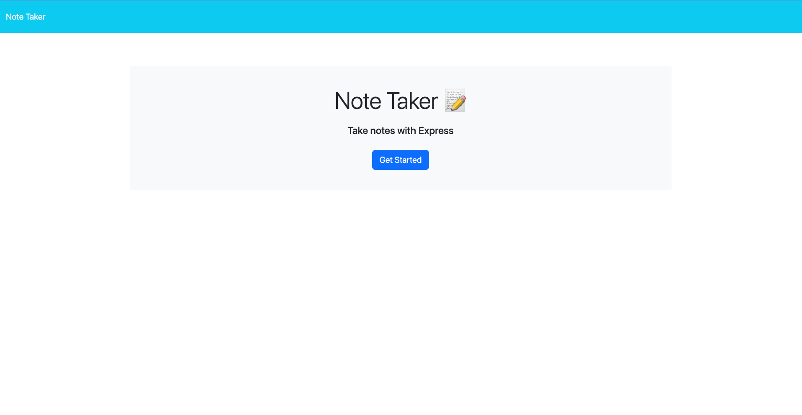
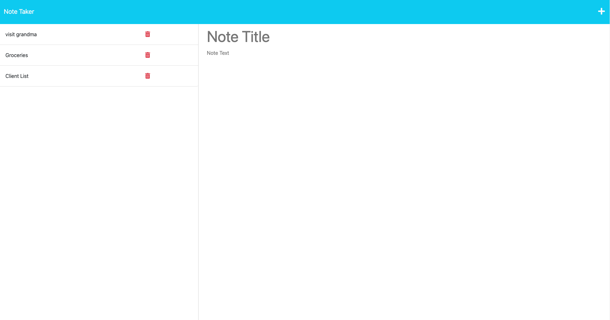

# NOTE TAKER README

## Description

The purpose of this project is to create an application that allows the user to type down notes, save them, and delete them as needed. Creating this application introduced me to working with express.js and getting more comfortable with working with creating backend server code. I learned how to create and work with routes and how to export the contents of those files into other files to make all of the content show up on the browser when the user deploys the page. I was also introduced to Heroku and learning how to deploy pages using the application.

## Table of Contents

* [Usage](#usage)
* [Acceptance Criteria](#criteria)
* [Screenshots](#screenshot)
* [Walkthrough Video](#video)

## User Story

A small business owner
I WANT to be able to write and save notes
SO THAT I can organize my thoughts and keep track of tasks I need to complete

## Acceptance Criteria

GIVEN a note-taking application

WHEN I open the Note Taker

THEN I am presented with a landing page with a link to a notes page

WHEN I click on the link to the notes page

THEN I am presented with a page with existing notes listed in the 
left-hand column, plus empty fields to enter a new note title and the note’s text in the right-hand column

WHEN I enter a new note title and the note’s text

THEN a Save icon appears in the navigation at the top of the page

WHEN I click on the Save icon

THEN the new note I have entered is saved and appears in the left-hand column with the other existing notes

WHEN I click on an existing note in the list in the left-hand column

THEN that note appears in the right-hand column

WHEN I click on the Write icon in the navigation at the top of the page

THEN I am presented with empty fields to enter a new note title and the note’s text in the right-hand column

## Installation
In order to get this application running I first had to run Node in order to run the server scripts. Node Package Managers (NPMs) such as express, fs, path, and uuid were needed in order to the the server scripts to work. I also worked with Heroku to deployment my application and used Insomnia to run tests to test out the code that would be going into the browser.

## Usage

In order to use this application the user must open up the browser, click on the button that's titled "Get Started". This will open up a server that has a section for the user to type a note tile, and note content. If the user wants to save the note, they must click the Save icon that is on teh right hand side of the screen and the note will become part of the list of notes on the left hand side. Once the user is ready to delete the note, the user can press the Trash icon, and the note will be deleted.

## Screenshot

## Walkthrough Video
Link to Video Demo: https://drive.google.com/file/d/1sFNyOCbO4evBTGDqzJkCWrdr4tlb4FJ_/view?usp=share_link

## Links
Deployed site: https://pacific-citadel-96313.herokuapp.com/

Repo: https://github.com/tatys5394/note-taker-app.git

